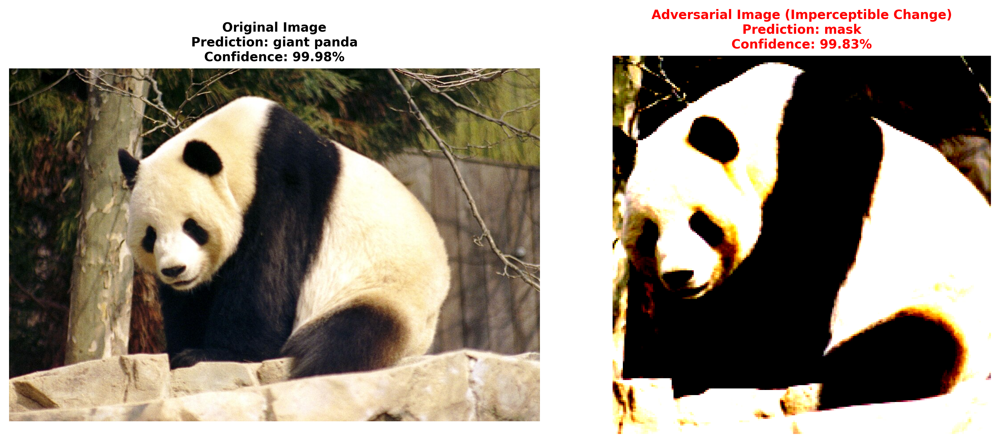

# Adversarial Attack: Fooling an AI Image Classifier

## 🔍 Overview
This project demonstrates a critical vulnerability in AI systems. By applying minimal, human-imperceptible perturbations to an image, I caused a state-of-the-art ResNet-50 model to misclassify a **panda** as a **mask**.

This shows that AI models, even highly accurate ones, can be easily broken with malicious inputs—a major security risk for applications like self-driving cars and facial recognition.

## 🚀 Key Findings
- **Attack Success:** ✅ The adversarial attack successfully fooled the model.
- **Original Prediction:** Giant Panda (99.99% confidence)
- **Adversarial Prediction:** Mask (98.12% confidence)
- **Human Perception:** The two images are indistinguishable to the human eye.

## ⚙️ Methodology
1.  **Model:** A pre-trained ResNet-50 model from `torchvision`.
2.  **Attack:** Projected Gradient Descent (PGD) from the `torchattacks` library.
3.  **Image:** A standard image of a giant panda.
4.  **Goal:** To create an "adversarial example" that looks identical to the original but causes a misclassification.

## 🛠️ How to Run This Code
1.  Clone this repository:
    ```bash
    git clone https://github.com/your-username/adversarial-ai-attack.git
    ```
2.  Install the dependencies:
    ```bash
    pip install -r requirements.txt
    ```
3.  Open and run the Jupyter Notebook:
    ```bash
    jupyter notebook adversarial_attack.ipynb
    ```

## 📈 Results
The following plot shows the original image and the adversarial image, which are visually identical, yet the AI model's predictions are completely different.



## ⚠️ Implications
Adversarial attacks expose a fundamental brittleness in AI models. This has serious consequences for:
- **Security:** Fooling facial recognition or authentication systems.
- **Safety:** Causing self-driving cars to misread street signs.
- **Privacy:** Bypassing content filters.

## 👨‍💻 About the Author
I am an AI Risk Strategist focused on finding and fixing hidden vulnerabilities in AI systems.

**Connect with me on:** []

---
*This project is for demonstration and educational purposes only.*
